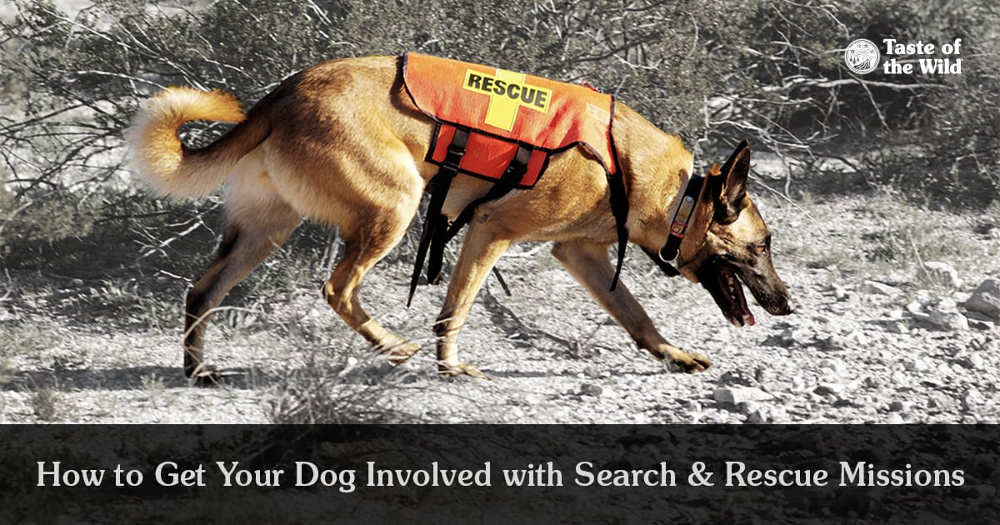
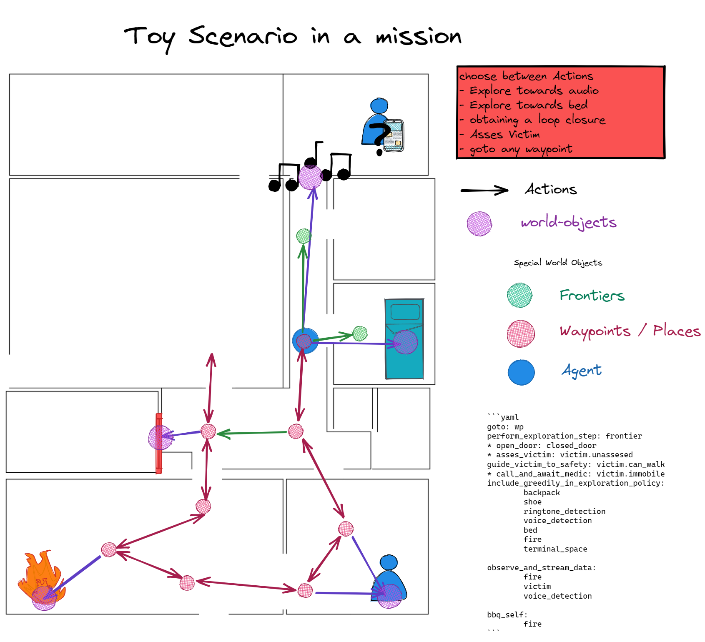

# Knowledge Roadmaps for Search and Rescue Missions 

## Goal
During exploration, the **Knowledge Roadmap** should ground the knowledge about mission critical entities spatially in a sparse graph structure which can be directly used for robot navigation.
This will enable spatial reasoning and especially for search and rescue scenarios this can provide a state graph like overview of the mission.

 


Here you can see WIP exploration in simulation to build the skeleton of the **Knowledge Roadmap**.

## Quick start
- goto the folder of the repo: `cd <path>/knowledge_roadmap`
- install dependencies: `pip install -r requirements.txt`
- install repo as a local editable package: `pip install -e .`
- select a demo config in `src/__main__.py` and run it (min Python 3.9).

If you get an error about missing tkinter on certain barebones linux distros:
- install the tkinter package:
```
sudo pacman -S tk          # on Arch based distros
sudo apt-get install tk    # on Debian based distros
```

# Background
## 🤖 Search and Rescue Missions 🐕‍🦺
Dogs have been man's best friend for 35,000 years.
They provide us with companionship and they assist us in some very intense and important work scenarios.
Time-sensitive Search-and-rescue missions are such an intense scenario and the environments where they take place typically present significant challenges including difficult terrain, unstable structures, degraded environmental conditions, and expansive areas of operation.
This is where robot dogs can contribute! Further research towards approaches to rapidly map, navigate, search and exploit disaster environments will ensure that first-responders are equipped with the technologies and capabilities necessary to effectively execute their future missions.


<!--  -->


## The General Picture
More generally is expected of robots to interact more richly with the world. Which is why us roboticists are no longer content with simply detecting and recognizing objects in images. Instead, what is desired is higher-level understanding and reasoning about complete dynamic 3D scenes. 
In robotics and related research fields, the study of understanding is often referred to as semantics, which dictates what does the world _‘mean'_ to a robot, this is strongly tied to the question of _how to represent that meaning._ Part of this twofold challenge is **semantic mapping**, which lies at the intersection of computer vision, task & motion planning, and simultaneous localization & mapping. 
My goal is to advance the design principles of semantic mapping to generalize its integration across task domains, by first analyzing the specific search-and-rescue domain.




# Dev
## Assumptions/Simplifications
- The exploration algorithms is _frontier based lowest cost-to-go (shortest path)_. 
- ~~Currently, the sampling of frontiers is simplified to sampling from a partially observable world graph. This should be expanded to sampling from the local-grid of the robot.~~
- The presented high level layer relies on robust local planners and controllers to deal with uncertainties at runtime.
  

### Conventions
Always pass the node indices/labels to one another and not the data objects. 
Data objects can be retrieved with get methods.

### TODO

#### To get results
- [ ] vizualize the object type of each node, including invalidated objects.
  - [ ] TODO: add valid property to each node or edge
- [ ] add the assess behavior
  - [ ] add the step to add new nodes to the graph based on object type to explore behavior
  - [ ] add the step to instantiate edges according to affordances to explore behavior.
- [ ] refactor the KRM to work with arbitrary objects and behaviors
- [ ] add the patrol hotspot behavior
  - [ ] add the hotspot object
- [ ] result show the mission in action on 3 differently configured scenarios.
  - [ ] which are just the affordances (objects, behaviors, objectives)

#### General
- [X] Code a generator for large graph world as a baseline for exploration and for testing.
- [X] Exploration on metric world instead of graph world.
- [ ] Emulate spot robot API one-on-one, 
- [X] run a test on the physical robot.
- [ ] Incorporate semantic information in exploration 
- [ ] Use the height of the local grid to calculate a risk for each frontier edge and sample multiple frontiers in the same region.
- [ ] Interface world-object classes with the knowledge base. If the world object class is correlated with the search target class, then it should influence how the surrounding region is valued for the search.

#### Usecases
- [X] Frontier Based Exploration
- [ ] Victim Assessment Action Mapping
